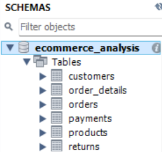

# E-Commerce Sales & Customer Analytics using SQL

## &#128202; Project Overview

This project focuses on analyzing e-commerce sales and customer data using SQL.

The project was created to practice SQL queries and perform data analysis on customers, products, orders, payments, and returns.

## &#128451; Database Tables

The database contains the following tables:

- Customers
- Products
- Orders
- Order_Details
- Payments
- Returns

## &#127919; Project Objectives

- Analyze customer information
- Analyze product and category performance
- Calculate sales and order metrics
- Analyze payment information
- Identify returned orders and return reasons
- Perform customer and sales analysis using SQL
- Practice SQL joins, aggregations, subqueries, and window functions

## &#128269; Key Analysis

- Analyzed customer and order information
- Calculated total sales and order metrics
- Analyzed product and category performance
- Examined payment methods and payment status
- Analyzed returned orders and return reasons
- Used SQL joins to combine data from multiple tables
- Used aggregate functions and GROUP BY for business analysis
- Used window functions such as RANK() for advanced analysis

## &#128247; Database Structure

## &#128187; Tools & Technologies

- MySQL
- MySQL Workbench
- SQL
- GitHub

## &#128203; SQL Concepts Used

- SELECT
- WHERE
- ORDER BY
- DISTINCT
- LIMIT
- Aggregate Functions
- GROUP BY
- HAVING
- JOINs
- Subqueries
- CASE Statements
- Date Functions
- Window Functions
- RANK()
- Views

## &#128193; Project Structure

E-Commerce-Sales-Customer-Analytics-SQL/

├── SQL/
│   └── ecommerce_analysis.sql

├── Screenshots/
│   └── database_tables.png

├── Data/

└── README.md

## &#128100; Author

Janardhanan Raghu